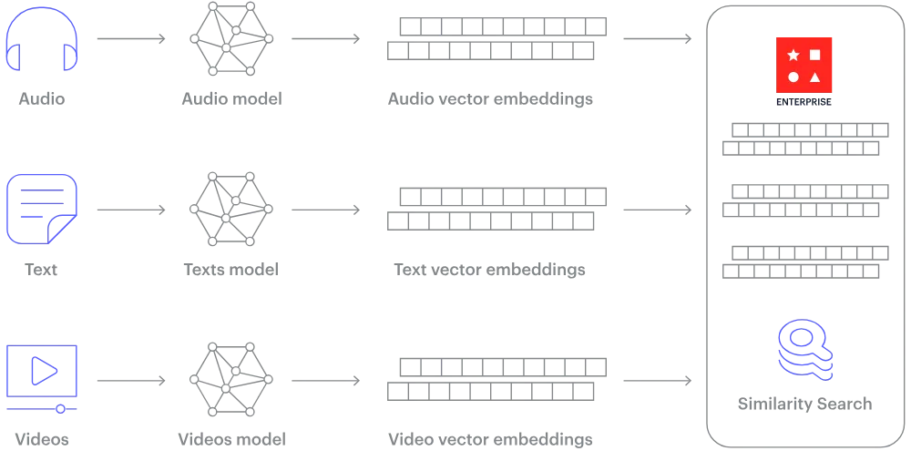
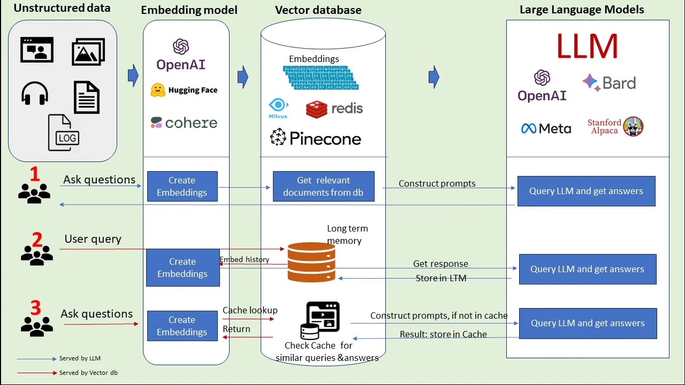

# Creating the Vector DB in RUST

- Key learning

## What is Vector database?

Vector databases stores unstructured data in the form of vectors that captures the meaning and
context of natural language processing and computer vison. They are designed to efficiently handle the storage and retrival of these dense numerical vectors through specialized data structures and indexing techniques, such as hierachical navigable data world (HNSW) and product
quantization. These databases enable users to find vectors that are most similar to a given query vector based on a chosen distance metric, such as Euclidean distance, cosine similarity, or dot product.

### Vector Embeddings

Vector embeddings are numerical represenatations of unstructured data, such as text, images or audios and even the videos in the form of vectors. These embeddings capture the semantic similarity of objects by mapping them to points in a vector space, where similar objects are represented by vectors that are close to each other.

### Vector Indexing

Vector indexing is a technique used to organize and retrieve data based on vector representations. Instead of storing data in traditional tabular or document formats, vector indices represent data objects as vectors in a multi-dimensional space.

### Distance Metrices

In the context of a vector database, a distance metric refers to a mathematical function that takes two vectors as input and calculates a distance value representing their similarity or dissimilarity. We use three distance measures to gauge the similarity of vectors. Selecting an effective distance measure improves classification and clustering performance.

### LLMs

Large language models (LLMs) are advanced deep-learning models that have been developed to process and analyze human languages. An LLM operates as a highly potent deep-learning model with the capability to comprehend and generate text similar to humans. At its core, this model utilizes a large-scale transformer model to achieve its impressive performance across fields and apps.

## Cosine Similarity

Cosine similarity measures the similarity between two vectors of an inner product space. It is measured by the cosine of the angle between two vectors and determines whether two vectors are pointing in roughly the same direction. It is often used to measure document similarity in text analysis.

A document can be represented by thousands of attributes, each recording the frequency of a particular word (such as a keyword) or phrase in the document. Thus, each document is an object represented by what is called a term-frequency vector. For example, in Table 2.5, we see that Document1 contains five instances of the word team, while hockey occurs three times. The word coach is absent from the entire document, as indicated by a count value of 0. Such data can be highly asymmetric.

Table 2.5. Document Vector or Term-Frequency Vector

| Document  | Team | Coach | Hockey | Baseball | Soccer | Penalty | Score | Win | Loss | Season |
| --------- | ---- | ----- | ------ | -------- | ------ | ------- | ----- | --- | ---- | ------ |
| Document1 | 5    | 0     | 3      | 0        | 2      | 0       | 0     | 2   | 0    | 0      |
| Document2 | 3    | 0     | 2      | 0        | 1      | 1       | 0     | 1   | 0    | 1      |
| Document3 | 0    | 7     | 0      | 2        | 1      | 0       | 0     | 3   | 0    | 0      |
| Document4 | 0    | 1     | 0      | 0        | 1      | 2       | 2     | 0   | 3    | 0      |

---

## Reasons to Use a Vector Database

High-Dimensional Data Handling:

- Vectors can represent complex data like text, images, audio, and user behavior. These data types are often transformed into high-dimensional vectors using various machine learning techniques.
- Vector databases are optimized to handle and store these high-dimensional vectors efficiently.
  Similarity Search:

- Traditional databases are not well-suited for similarity search, especially in high-dimensional spaces.
- Vector databases provide efficient algorithms (like k-NN, ANN) to find similar items.
- Useful for applications where finding similar items or recommendations is crucial.
  Performance and Scalability:

- Vector databases are built to handle large datasets with millions or even billions of vectors.
- They use optimized data structures (like inverted indices, trees, or graphs) to ensure fast retrieval times.

UseCase :

- Recommendation system
- Image and Video Search
- NLP

## How Vector Databases Work

Data Representation:

Data is transformed into vectors using embedding techniques. For example, word embeddings (Word2Vec, GloVe) for text, CNN embeddings for images, etc.
Indexing:

Vectors are indexed using data structures like KD-trees, VP-trees, or graph-based indices to facilitate fast similarity searches.
Querying:

Given a query vector, the database retrieves the most similar vectors using similarity metrics like cosine similarity, Euclidean distance, etc.

## Workflow

1. Embedding ( Convert raw data into vectors using machine learning models )
2. Store these vectors in vector databases.
3. Search [
   When a query is made, convert the query data into a vector.
   Use the vector database to find the most similar vectors.
   ]

Vector databases are essential for applications requiring efficient handling and querying of high-dimensional data. They are optimized for similarity search and provide the necessary performance and scalability for large datasets. Common use cases include recommendation systems, image and video search, NLP, fraud detection, and personalization.

Dedicated vector databases or libraries such as:

- FAISS (Facebook AI Similarity Search)
- Annoy (Approximate Nearest Neighbors Oh Yeah)
- Milvus (Open-source vector database built for scalable similarity search)
